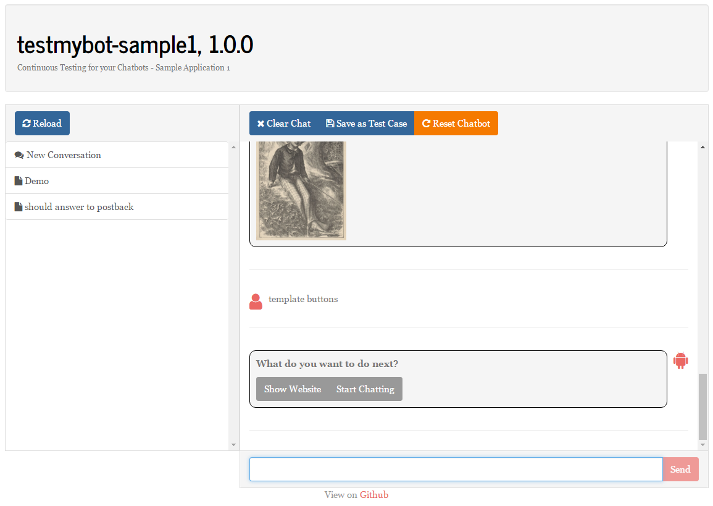

Test My Bot
===========

TestMyBot is a test automation framework for your chatbot project. It is unopinionated and completely agnostic about any involved development tools. Best of all, it’s free and open source.

Your test cases are recorded by Capture & Replay tools and can be run against your Chatbot implementation automatically over and over again. It is meant to be included in your continuous integration pipeline, just as with your unit tests.

## Blog Articles

Here are links to some articles about TestMyBot:

[Selenium for Chatbots — Introducing Botium](https://chatbotsmagazine.com/selenium-for-chatbots-introducing-botium-1f1f0b3d4164)

[Serverless Monitoring Of Your Facebook Chatbot in 3 Easy Steps](https://chatbotsmagazine.com/serverless-monitoring-of-your-facebook-chatbot-in-3-easy-steps-a051b4f248a8) (outdated)

[Capture & Replay: Bringing Chatbot Code Quality To a New Level](https://chatbotsmagazine.com/capture-replay-bringing-chatbot-code-quality-to-a-new-level-c0312971311a) (outdated)

[Continuous Automated Testing for Your Chatbot With Open Source Tool “TestMyBot”](https://chatbotsmagazine.com/continuous-automated-testing-for-your-chatbot-with-open-source-tool-testmybot-53fd3757764e) (outdated)

[No More Excuse: Automated Testing of your Chatbot with “TestMyBot”](https://chatbotsmagazine.com/no-more-excuse-automated-testing-of-your-chatbot-with-testmybot-3c1ed98dd043) (outdated)

## Botium, the Selenium for Chatbots

TestMyBot relies on [Botium, the Selenium for Chatbots](https://github.com/codeforequity-at/botium-core) to connect to your Chatbot, either in a Sandbox environment or in a live environment. TestMyBot reads the file "testmybot.json" to configure your Botium container.

You can read more about Botium and TestMyBot [here](https://chatbotsmagazine.com/selenium-for-chatbots-introducing-botium-1f1f0b3d4164)

Quick Start
===========

Please check out one of the samples to get a quick overview.

    $ git clone https://github.com/codeforequity-at/testmybot.git
    $ cd testmybot/samples/facebook
    $ npm install
    $ npm test

Installation and Basic Usage
============================

Usually, you won't install this project on it's own, but you will include it in your Chatbot projects.

To install it to your chatbot project, type:

    $ npm install testmybot --save-dev

Please note that you have to install it in your local development directory (not in global registry with -g).

With [Jasmine](https://jasmine.github.io/), the setup looks like this:

    $ npm install testmybot --save-dev
    $ npm install jasmine --save-dev
    $ ./node_modules/.bin/jasmine init
	
Add a file named "testmybot.json" to your project directory. A very basic configuration for a Facebook Chatbot looks like this:

	{
	  "botium": {
	    "Capabilities": {
	      "PROJECTNAME": "testmybot-sample1",
	      "FACEBOOK_API": true,
	      "FACEBOOK_WEBHOOK_PORT": 5000,
	      "FACEBOOK_WEBHOOK_PATH": "webhook",
	      "CLEANUPTEMPDIR": false,
	      "STARTCMD": "node index.js"
	    },
	    "Envs": {
	      "NODE_TLS_REJECT_UNAUTHORIZED": 0,
	      "NODE_ENV": "dev"
	    }
	  }
	}

If your Chatbot code is located in a Git repository, you can make Botium load it from there:

	{
	  "botium": {
	    "Capabilities": {
	      "PROJECTNAME": "testmybot-sample1",
	      "FACEBOOK_API": true,
	      "FACEBOOK_WEBHOOK_PORT": 5000,
	      "FACEBOOK_WEBHOOK_PATH": "webhook",
	      "CLEANUPTEMPDIR": false,
	      "STARTCMD": "node index.js"
	    },
	    "Sources": {
	      "GITURL": "https://github.com/jw84/messenger-bot-tutorial",
	      "GITPREPARECMD": "npm install"
	    },
	    "Envs": {
	      "NODE_TLS_REJECT_UNAUTHORIZED": 0,
	      "NODE_ENV": "dev"
	    }
	  }
	}

You tell TestMyBot that the Facebook Webhook of your chatbot runs on port 5000, and the url path is /webhook.

Add a file spec/testmybot.spec.js with a basic test case:

    describe('TestMyBot Sample Conversation Test Suite', function() {
      var bot = require('testmybot');

      beforeAll(function(done) {
        bot.beforeAll().then(done);
      }, 120000);

      beforeEach(function(done) {
        bot.beforeEach().then(done);
      }, 60000);

      afterEach(function(done) {
        bot.afterEach().then(done);
      }, 60000);

      afterAll(function(done) {
        bot.afterAll().then(done);
      }, 60000);

      it('should answer to hello', function(done) {

        bot.hears('hello');

        bot.says().then((msg) => {
          expect(msg.messageText).toMatch(/echo/);
          done();
        }).catch((err) => {
          throw new Error(err);
        });
      });
    });

Take special care for:
* All test are asynchronous
* Setup and Teardown has high timeouts, because buildling, running and stopping Docker containers can take some time. Especially on first run, it will take very long. Afterwards, the Docker cache speeds up things.
* The test API is rather simple
  * bot.hears: send a text (or structured content) to your chatbot
  * bot.says: receive a text (or structured content) from your chatbot

You can hand over environment variables to your chatbot here. 
And finally, run your tests with Jasmine:

    $ ./node_modules/.bin/jasmine

In the end, your Jasmine tests should succeed (of course).

How to Compose Test Cases
=========================
As is it very hard to compose your test cases from a combination of bot.hears / bot.says instructions to the test runner, TestMyBot is able to run your test cases from previously recorded conversations. The conversations are loaded from simple text files. The conversation files should be included in your project and added to your source code control, just as with other test specs (usually to folder ./spec/convo/*.convo.txt).

## Convo Files
We made a strong decision to not use any standard file format like JSON or XML for writing the test cases, as they should be kept extremly simple. It should be so simple that everyone could compose the conversation files manually. Here is an example for a simple test conversation:

    Call Me Captain
    A simple Test Case 

    #me
    hello

    #bot
    Try: `what is my name` or `structured` or `call me captain`

    #me
    call me captain

    #bot
    Got it. I will call you captain from now on.

    #me
    who am i

    #bot
    Your name is captain

The semantics are simple:
* The first line is the name of the test case
* The second line up to the first line starting with # is an optional description text
* A line starting with #me will send the following text to your Chatbot
  * Anything following will be the channel to send to - for example: #me #private will send the message to the private channel (Slack only)
* A line starting with #bot will expect your Chatbot to answer accordingly
  * Anything following will be the channel to listen to - for example: #bot #general will wait for a message on the #general-channel (Slack only)
  
That's it. 

## Structured Messages
Actually, for sending structured messages, you can include the message content in this conversation files as well:

    #bot
    {
        "message": {
            "attachment": {
                "type": "template",
                "payload": {
                    ....
                }
            }
        }
    }

    #me
    {
        "postback": {
            "payload": "White T-Shirt"
        }
    }

## Capture & Replay Tools
Especially with structured messages, it can become uncomfortable to write those conversation files manually. TestMyBot contains two emulators to support you with writing your conversation files:

### Browser Emulator
The TestMyBot Browser Emulator provides a simple browser interface to record and organize your test cases, and to interact with your Chatbot.

Running it is simple:

    $ node node_modules/testmybot/emulator-browser.js

It will show all test cases from the ./spec/convo/-Folder and will write new conversations to this directory as well.

### Console Emulator
The TestMyBot Console Emulator is a basic command line interface to your Chatbot running within TestMyBot. You can record and save your conversation files.

Installation and running it is simple:

    $ node node_modules/testmybot/emulator-console.js

## Running the conversation files

You have to advice the TestMyBot library within your test specification how to add test cases to your test runner. In the following example, you advice it to add the test cases to Jasmine - just place this code in the file spec/testmybot.spec.js:

	const bot = require('testmybot');
	bot.helper.jasmine().setupJasmineTestSuite(60000);

There are helpers available for Jasmine and Mocha (see [samples](https://github.com/codeforequity-at/testmybot/tree/master/samples)), but TestMyBot actually is agnostic about the actual test runner you are using. The example above can be adapted to other test runners easily.

API
===
* testmybot.beforeAll(config) - builds Docker networking and containers from your configuration
  * config (optional) - you can pass an optional configuration argument (merged into other configuration)
  * returns a bluebird Promise
* testmybot.afterAll() - removes Docker networking and containers
  * returns a bluebird Promise
* testmybot.beforeEach() - starts Docker containers and waits until online
  * returns a bluebird Promise
* testmybot.afterEach() - stops Docker containers
  * returns a bluebird Promise
* testmybot.hears({ messageText, sourceData, sender, channel, sourceData }) - send a text (or structured content) to your chatbot
  * messageText - text
  * sourceData - structured content
  * sender (optional) - sender of the message
  * channel (optional) - the channel to send your message to (Slack only). You can mock parallel conversations with multiple users
* testmybot.says(channel, timeoutMillis) - receive a text (or structured content) from your chatbot
  * channel (optional) - receive for this channel (Slack only)
  * timeoutMillis (optional) - timeout when not receiving anything (default: 5000)
  * returns a Promise, which resolves to the the received message. 
 
Outlook
=======
Work is ongoing

- [x] Support Facebook Chatbots
- [x] Support Slack Chatbots
- [ ] Support Wechat Chatbots
- [x] Support Node.js Chatbots
- [x] Support Microsoft Bot Framework Chatbots
- [x] Support Python Chatbots
- [x] Define Test Cases with TestMyBot API calls
- [x] Define Test Cases by conversation transcripts
- [x] Run your Tests in _live environment_ with _real_ Endpoints

License
=======
MIT License

Copyright (c) 2017 Code For Equity

Permission is hereby granted, free of charge, to any person obtaining a copy
of this software and associated documentation files (the "Software"), to deal
in the Software without restriction, including without limitation the rights
to use, copy, modify, merge, publish, distribute, sublicense, and/or sell
copies of the Software, and to permit persons to whom the Software is
furnished to do so, subject to the following conditions:

The above copyright notice and this permission notice shall be included in all
copies or substantial portions of the Software.

THE SOFTWARE IS PROVIDED "AS IS", WITHOUT WARRANTY OF ANY KIND, EXPRESS OR
IMPLIED, INCLUDING BUT NOT LIMITED TO THE WARRANTIES OF MERCHANTABILITY,
FITNESS FOR A PARTICULAR PURPOSE AND NONINFRINGEMENT. IN NO EVENT SHALL THE
AUTHORS OR COPYRIGHT HOLDERS BE LIABLE FOR ANY CLAIM, DAMAGES OR OTHER
LIABILITY, WHETHER IN AN ACTION OF CONTRACT, TORT OR OTHERWISE, ARISING FROM,
OUT OF OR IN CONNECTION WITH THE SOFTWARE OR THE USE OR OTHER DEALINGS IN THE
SOFTWARE.
